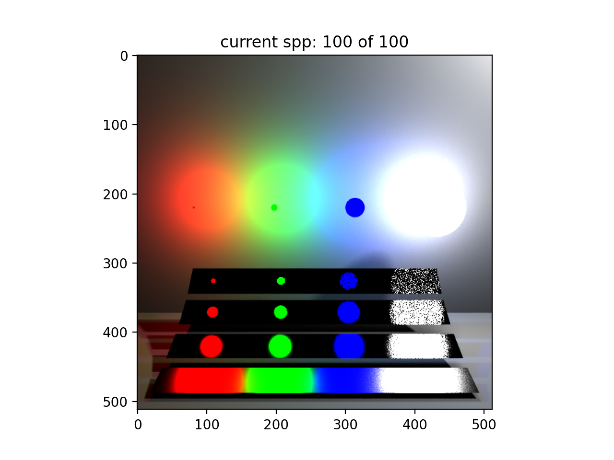
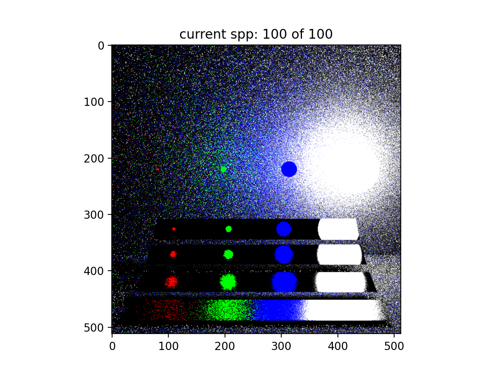
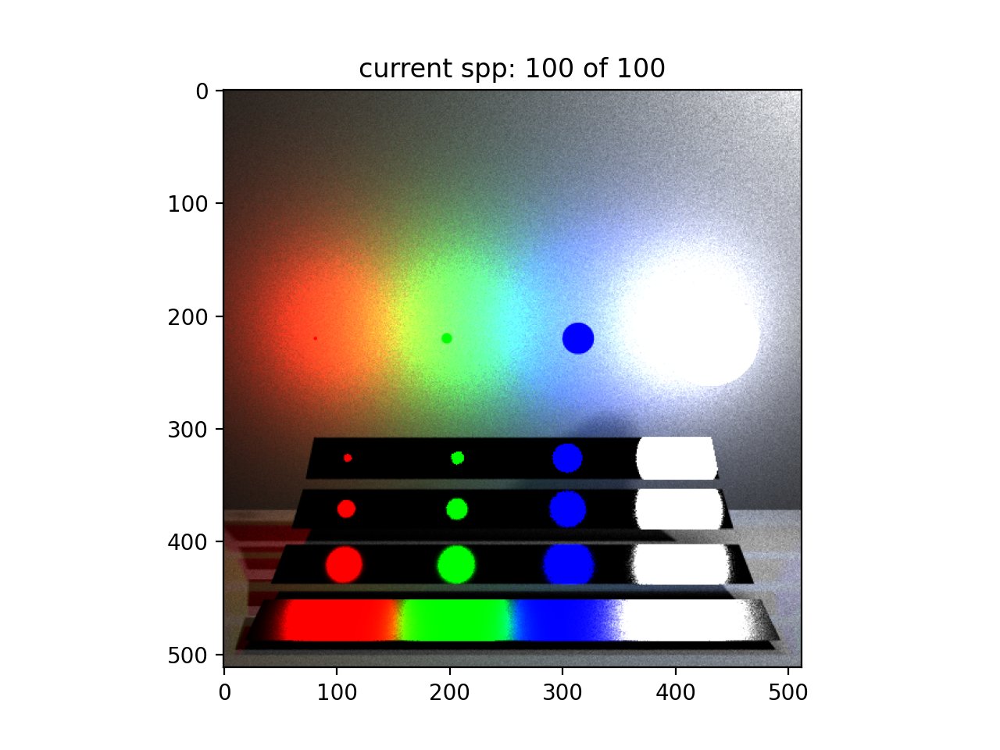
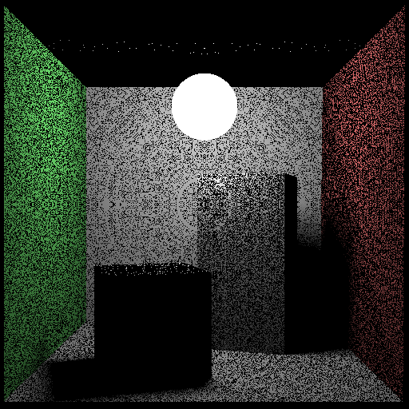
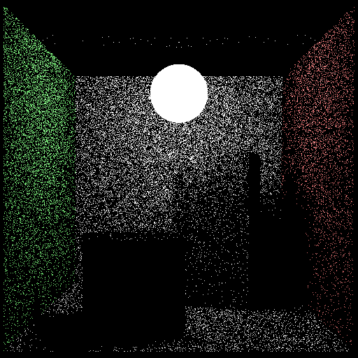
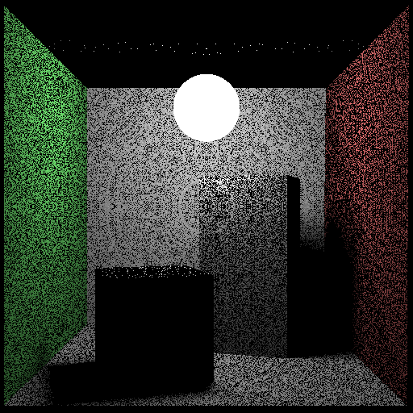

# NumPy-Rendering

[](LICENSE)

A modular, educational CPU-based ray tracer built with **NumPy**.
Supports configurable scenes, multiple sampling strategies (cosine, uniform, MIS), sphere and mesh primitives, and progressive rendering via YAML-driven configs.

---

## 🚀 Features

- **Object-Oriented Design**  
  Clean abstractions for camera, scene, geometry, and samplers.
- **Configurable via YAML**  
  Define camera, image, sampler, and scene objects in a single `config.yaml`.
- **Multiple Sampling Strategies**  
  Cosine-weighted, uniform hemisphere, and Multiple Importance Sampling (MIS).
- **Primitives**  
  Spheres and triangle meshes loaded from `.npz` (vertices, faces, normals).
- **Progressive Rendering**  
  Visualize convergence sample-by-sample.
- **Extensible**  
  Add new samplers or materials by registering classes—no core changes required.

---
## 🔬 About this Project

This repository provides a simplified NumPy-based physics rendering playground, designed for research and rapid experimentation in graphics and differential rendering. Its primary goal is clarity and extensibility, making it easy to plug in new sampling, shading, or integration algorithms without worrying about performance optimizations.

## ⚠️ What it Does NOT Do

- Optimized ray–object intersection acceleration structures (e.g., BVH, KD-trees)

- Level-of-detail (LOD) management or mesh simplification

- Frustum culling or near/far plane clipping

- GPU acceleration, multi-threading (Can be done with drop-in CuPy)

- Advanced material models (e.g., glossy, anisotropic, subsurface scattering)

- Real-time or production-level performance optimizations

- Texture mapping or UV-based materials

---

## 📋 Table of Contents

1. [Installation](#installation)  
2. [Quick Start](#quick-start)  
3. [Configuration](#configuration) 
4. [Results](#sample_results) 
5. [Project Structure](#project-structure)  
6. [Adding New Samplers](#adding-new-samplers)  
7. [Contributing](#contributing)  
8. [License](#license)

---

## 🛠️ Installation

1. **Clone the repository**
   ```bash
   git clone https://github.com/jadevaibhav/numpy-rendering.git
   cd numpy-rendering
   ```

2. **Create a virtual environment** (recommended)
   ```bash
   python3 -m venv venv
   source venv/bin/activate
   ```

3. **Install dependencies**
   ```bash
   pip install numpy pyyaml trimesh
   ```

> **Note:** `trimesh` is required only if you load `.obj` meshes. Meshes saved in `.npz` format need only NumPy.

---

## 🎬 Quick Start

1. **Edit / create a YAML config** (see [Configuration](#configuration) below).
2. **Run the renderer**:
   ```bash
   python run_wip.py --config config/veach_config.yaml --spp 64
   ```
   - `--config` : Path to your YAML scene file.
   - `--spp`    : Samples per pixel (overrides config).

3. **View the output**  
   The renderer will display a progressive window. Final image is saved to `outputs/`

---

## 📝 Configuration

All settings live in a single YAML file. Example `config/veach_config.yaml`:

```yaml
image:
  width: 512
  height: 512
  spp: 64
  output_path: "outputs/veach.png"

camera:
  position: [0.0, 2.0, 15.0]
  look_at:  [0.0, -2.0, 2.5]
  up:       [0.0, 1.0, 0.0]
  fov:      40.0

sampler:
  type: "mis"            # "cosine", "uniform", or "mis"
  params:
    num_samples: 64
    balance:     true    # only for MIS

scene:
  geometries:
    - type: "Sphere"
      radius: 0.0333
      center: [3.75, 0.0, 0.0]
      emission: [9018.03, 0.0, 0.0]

    - type: "Mesh"
      path:        "models/plate1.npz"
      brdf_params: [1.0, 1.0, 1.0, 30000.0]
```

### Key Sections

- **`image`**: Output resolution, spp, and save path.
- **`camera`**: Pinhole camera parameters.
- **`sampler`**: Select sampling strategy and its parameters.
- **`scene.geometries`**: List of primitives—
  - **Sphere**: `radius`, `center`, optional `emission`.
  - **Mesh**: `.npz` file with `'v','f','vn'`, plus `brdf_params`, optional `emission`, `scale` & `translation`.

---

## 🖼️ Sample Results

### Scene 1 — Veach Scene

| Light Sampling | BRDF Sampling | MIS Sampling |
|-----------------|------------------|--------------|
|  |  |  |

---

### Scene 2 — Cornell Box

| Light Sampling | BRDF Sampling | MIS Sampling |
|-----------------|------------------|--------------|
|  |  |  |
---

## 📂 Project Structure

```text
numpy-rendering/
├── config/               # YAML scene configs
│   └── veach_config.yaml
├── models/               # Preprocessed meshes
│   └── *.npz
├── primitives/           # Geometry, camera, scene
│   ├── primitive.py
│   ├── sphere.py
│   ├── mesh.py
│   ├── scene.py
│   └── camera.py
├── renderer/             # Raytracer
│   └── raytracer.py
├── sampling/             # Sampling methods and registry
│   ├── sampling.py
│   └── registry.py
├── run_wip.py            # CLI entry point
└── README.md
```

---

## ✨ Adding New Samplers

1. **Implement** your sampler by subclassing `Sampler` in `sampling/sampling.py`:

   ```python
   @register_sampler("my_sampler")
   class MySampler(Sampler):
       def __init__(self, num_samples: int, my_param: float = 1.0):
           ...
       def sample_brdf(...): ...
       def eval_brdf_pdf(...): ...
       def sample_light(...): ...
       def eval_light_pdf(...): ...
       def illumination(...): ...  # for MIS-like integrators
   ```

2. **Update config**:

   ```yaml
   sampler:
     type: "my_sampler"
     params:
       num_samples: 32
       my_param:    2.5
   ```

The registry auto-registers your class—no other changes needed.

---

## 🤝 Contributing

1. Fork the repo
2. Create a feature branch (`git checkout -b feature/…`)
3. Commit your changes (`git commit -am "Add …"`)
4. Push to the branch (`git push origin feature/…`)
5. Open a Pull Request

Please follow the existing style and include tests for new samplers or features.

---

## 📄 License

This project is released under the [MIT License](LICENSE).
Feel free to use, modify, and distribute!

---

> Built by [Vaibhav Jade](https://github.com/jadevaibhav) as a learning project in physically based rendering.
> ⭐ If you find this useful, please give it a ⭐ on GitHub!

